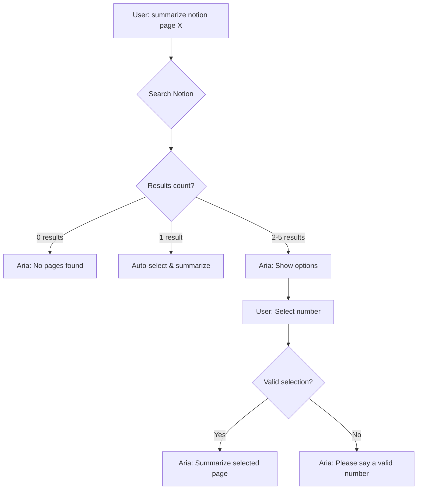

# Page Selector Feature - Usage Guide

## 🎯 What's New

When you search for a Notion page and **multiple pages match**, Aria will now:
1. Show you up to 5 options
2. Ask you to choose which one to summarize
3. Summarize your selected page

---

## 📝 Example Conversation

### Scenario: You have multiple "Meeting Notes" pages

**You type:**
```
summarize notion page meeting notes
```

**Aria responds:**
```
Let me get that Notion page for you...
Searching for meeting notes...
I found 5 pages matching 'meeting notes'. Here are your options:

Option 1: 📝 Meeting Notes - Jan 2025
Option 2: 📝 Meeting Notes - Feb 2025  
Option 3: 🗓️ Meeting Notes Archive
Option 4: Meeting Notes Template
Option 5: 💼 Executive Meeting Notes

Which one would you like me to summarize? Say the number.
```

**You type:**
```
one
```
(or "first", "1", "number one")

**Aria responds:**
```
Great! Fetching Meeting Notes - Jan 2025...
Fetching page content...
Summarizing Meeting Notes - Jan 2025...
Here's a summary of 'Meeting Notes - Jan 2025' (approximately 234 words): [summary]
```

---

## 🎤 Selection Methods

You can respond in multiple ways:

| Input | Result |
|-------|--------|
| `one` or `1` | Selects option 1 |
| `first` | Selects option 1 |
| `two` or `2` | Selects option 2 |
| `second` | Selects option 2 |
| `three` or `3` | Selects option 3 |
| `third` | Selects option 3 |
| `four` or `4` | Selects option 4 |
| `five` or `5` | Selects option 5 |

---

## ✨ Smart Behaviors

### Single Match - Automatic
If only **1 page** matches, Aria automatically proceeds:

**You:**
```
summarize notion page The Pursuit of Happiness
```

**Aria:**
```
Let me get that Notion page for you...
Searching for The Pursuit of Happiness...
Fetching page content...
[proceeds automatically - no selection needed]
```

---

### Multiple Matches - Interactive
If **2-5 pages** match, Aria asks you to choose:

**You:**
```
summarize notion page project
```

**Aria:**
```
I found 3 pages matching 'project'. Here are your options:
Option 1: 🚀 Project Alpha
Option 2: 📊 Project Beta
Option 3: ✅ Project Planning
Which one would you like me to summarize? Say the number.
```

---

### Direct URL - Bypass Selection
If you provide a **URL**, Aria goes straight to that page:

**You:**
```
summarize notion page https://notion.so/My-Page-abc123
```

**Aria:**
```
Let me get that Notion page for you...
Fetching page content...
[no search needed - direct access]
```

---

## 🔄 Conversation Flow



---

## 💡 Pro Tips

### 1. **Be Specific to Avoid Selection**
Instead of:
```
summarize notion page notes
```
(may return 10+ pages)

Say:
```
summarize notion page january meeting notes
```
(more likely to return 1-2 pages)

---

### 2. **Use Icons in Search**
If your pages have emoji icons:
```
summarize notion page 📝 notes
```

---

### 3. **Cancel Selection**
If you want to start over after seeing options:
```
cancel
```
or
```
never mind
```
(Note: This requires adding cancel logic - not implemented yet)

---

## 🚀 Quick Start

**Test it now:**

1. Type in Aria's chat:
   ```
   summarize notion page notes
   ```
   (or any common word that appears in multiple page titles)

2. Aria will show you options

3. Type:
   ```
   1
   ```
   or
   ```
   first
   ```

4. Aria will summarize your selected page!

---

## 📊 Comparison: Before vs After

| Scenario | Before | After |
|----------|--------|-------|
| 1 match | ✅ Auto-summarize | ✅ Auto-summarize |
| Multiple matches | ❌ Picks first only | ✅ Shows options |
| Wrong page picked | 😞 No way to fix | 😊 Choose correct one |
| User control | ⚠️ Limited | ✅ Full control |

---

## ⚙️ Technical Details

- **Max options shown:** 5 pages
- **Selection timeout:** No timeout (waits for your input)
- **State persistence:** Cleared after selection or error
- **Supported inputs:** Numbers (1-5), number words (one-five), ordinals (first-fifth)

---

## 🎉 Summary

You now have **full control** over which Notion page to summarize! No more guessing which "Meeting Notes" page Aria picked. Just choose from the options and get exactly what you need.
