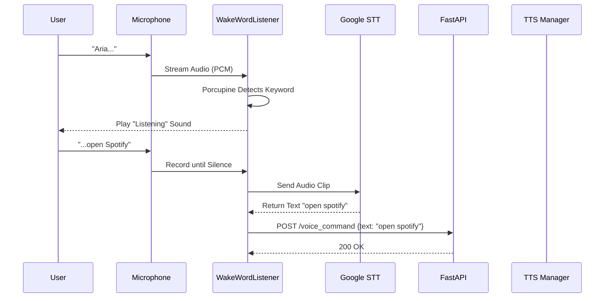

# 🏗️ Aria System Architecture & Process Bible

This document is the **definitive technical reference** for the Aria system. It details the data flow, architectural decisions, API contracts, and error handling mechanisms for every component.

---

## 1. 🏛️ High-Level Architecture

Aria follows a **Client-Server Architecture** running locally on the user's machine.

```mermaid
graph TD
    subgraph "Frontend (Electron/Node.js)"
        UI[User Interface (HTML/CSS)]
        Renderer[Renderer Process (JS)]
        Main[Main Process (Node.js)]
    end

    subgraph "Backend (Python/FastAPI)"
        API[FastAPI Router]
        
        subgraph "Core Logic"
            CP[Command Processor]
            Brain[LLM Brain (GPT-4o)]
            RAG[RAG Memory (ChromaDB)]
        end
        
        subgraph "Managers"
            AL[App Launcher]
            SC[System Control]
            MM[Music Manager]
            CM[Calendar Manager]
            FM[File Manager]
        end
        
        subgraph "Background Services"
            PM[Proactive Manager]
            WAKE[Wake Word Listener]
        end
    end

    UI <--> Renderer
    Renderer <-->|IPC| Main
    Main <-->|HTTP REST| API
    
    WAKE -->|Voice Input| API
    API --> CP
    CP --> Brain
    Brain <--> RAG
    CP --> Managers
    PM --> CP
```

---

## 2. 🗣️ Voice Interaction Flow (Deep Dive)

**Objective**: Convert raw audio into actionable intent with minimal latency.

### Sequence Diagram


### Technical Details
*   **Wake Word Engine**: `pvporcupine` (Local, Privacy-First).
    *   *Why?* No audio leaves the device until the wake word is detected.
*   **Silence Detection**: Uses RMS (Root Mean Square) amplitude thresholding.
*   **Error Handling**:
    *   *No Speech*: Timeout after 5 seconds -> Play "Error" sound.
    *   *No Internet*: STT fails -> Play "Offline" sound.

---

## 3. 🧠 Command Processing Pipeline

**Objective**: Deterministically map text to code execution.

### The Decision Logic (`CommandProcessor.py`)

1.  **Preprocessing**:
    *   `text.lower().strip()`
    *   Remove wake word: `text.replace("aria", "")`

2.  **Layer 1: Regex/Keyword Matching (0ms Latency)**
    *   *Input*: "activate coder mode"
    *   *Logic*: `if "activate coder mode" in text:`
    *   *Action*: Immediate function call.
    *   *Pros*: Fast, reliable, no API cost.

3.  **Layer 2: LLM Intent Classification (1-2s Latency)**
    *   *Input*: "Play some relaxing jazz for coding"
    *   *Logic*: Send to GPT-4o with `system_prompt`:
        ```json
        {
            "role": "system",
            "content": "You are a classifier. Output JSON: {intent: string, parameters: dict}"
        }
        ```
    *   *Output*:
        ```json
        {
            "intent": "music_play",
            "parameters": {
                "song": "relaxing jazz",
                "context": "coding"
            }
        }
        ```

4.  **Layer 3: Execution Dispatch**
    *   The `intent` string maps to a handler function in `CommandProcessor`.
    *   `"music_play"` -> `self.music_manager.play_music(song)`

---

## 4. 💾 RAG Memory System (Context Awareness)

**Objective**: Remember user preferences and past conversations indefinitely.

### Architecture
*   **Database**: `ChromaDB` (Local Vector Store).
*   **Embedding Model**: `all-MiniLM-L6-v2` (Local, Fast).

### Storage Flow (`Brain.py`)
1.  **User Input**: "My favorite color is blue."
2.  **Embedding**: Text is converted to a 384-dimensional vector.
3.  **Storage**: Vector + Metadata (`{"type": "fact", "timestamp": 12345}`) saved to `./vector_db`.

### Retrieval Flow
1.  **User Input**: "What should I wear?"
2.  **Query**: System searches DB for vectors similar to "What should I wear?".
3.  **Result**: Finds "My favorite color is blue" (Distance < 0.5).
4.  **Context Injection**:
    *   LLM Prompt: "Context: User loves blue. Question: What should I wear?"
    *   LLM Answer: "How about a blue shirt?"

---

## 5. 🔄 UI Synchronization (The Polling Loop)

**Objective**: Update the UI based on backend events without WebSockets (for simplicity/robustness).

### The Notification Queue
*   **Backend**: `NotificationManager.py` maintains a `deque` (double-ended queue) of events.
*   **Event Structure**:
    ```json
    {
        "id": "uuid-1234",
        "type": "mode_change",
        "data": {
            "mode": "coder"
        },
        "timestamp": "2023-10-27T10:00:00"
    }
    ```

### The Polling Mechanism
1.  **Frontend (`main.js`)**: Runs `setInterval(checkNotifications, 1000)`.
2.  **Request**: `GET http://localhost:8000/notifications`.
3.  **Response**: Returns list of *new* events since last check.
4.  **Action**:
    *   `mode_change` -> Update CSS class on `#mode-badge`.
    *   `music_playing` -> Update `#music-player` DOM.
    *   `email_confirmation` -> Show Modal Dialog.

---

## 6. 🎵 Music Streaming Architecture

**Objective**: Play any song from YouTube without a browser head.

### Components
*   **Search**: `yt_dlp` (YouTube Downloader).
    *   *Role*: Scrapes YouTube search results to find the *Video ID*.
*   **Extraction**: `yt_dlp.YoutubeDL`.
    *   *Role*: Extracts the actual `.webm` or `.m4a` audio stream URL.
    *   *Note*: This URL is temporary and tied to IP.
*   **Playback**: `python-vlc` (LibVLC wrapper).
    *   *Role*: Streams the URL directly.
    *   *Features*: Volume control, Pause/Resume, Stop.

### Error Handling
*   **Region Lock**: If YouTube blocks the IP, `yt_dlp` throws an error -> Aria says "I couldn't play that song."
*   **VLC Crash**: Wrapped in `try/except` to restart the VLC instance if it hangs.

---

## 7. 🤖 Proactive Background Services

**Objective**: Perform actions without user input.

### The Loop (`ProactiveManager.py`)
*   **Frequency**: Runs every 60 seconds (`time.sleep(60)`).
*   **Thread**: Runs in a separate `threading.Thread` to avoid blocking the API.

### Logic Example: Calendar Monitor
1.  **Fetch**: Get events for the next 15 minutes from `CalendarManager`.
2.  **Analyze**:
    *   Event: "Deep Work Session"
    *   Keywords: ["work", "code", "focus"]
3.  **Trigger**:
    *   If match found AND not already triggered:
        *   Call `brain.set_mode("coder")`.
        *   Call `system_control.set_dnd(True)`.
        *   Speak: "I see you have a work session. Activating Coder Mode."

---

## 8. 📂 File System Automation

**Objective**: Organize files automatically.

### The Automator (`FileAutomator.py`)
*   **Trigger**: User command "Organize Downloads".
*   **Logic**:
    *   Iterate through `C:\Users\Name\Downloads`.
    *   Check file extension:
        *   `.jpg, .png` -> Move to `Downloads/Images`
        *   `.pdf, .docx` -> Move to `Downloads/Documents`
        *   `.exe, .msi` -> Move to `Downloads/Installers`
*   **Safety**:
    *   Checks for name collisions (e.g., `image.jpg` exists).
    *   Renames to `image_1.jpg` if needed.
    *   Never deletes files, only moves.

---

## 9. 🛡️ Error Handling & Recovery

**Objective**: Keep the system running even if parts fail.

1.  **API Failures**:
    *   If OpenAI API is down -> Fallback to "Offline Mode" (Limited commands).
    *   If Google STT fails -> Aria says "I didn't catch that."

2.  **Process Management**:
    *   If the Python backend crashes, the Electron app detects the `child_process` exit.
    *   **Auto-Restart**: Electron attempts to respawn the Python process automatically.

3.  **Logging**:
    *   All errors are written to `aria.log` with tracebacks.
    *   `logger.py` handles rotation (keeps log files small).
